[⬅️ 상위 README로 이동](../README.md)

## 📘 알고리즘: KMP (Knuth, Morris, Pratt)

## 📌 목차

* [1. 개념 소개](#1-개념-소개)
* [2. 주요 용어](#2-주요-용어)
* [3. LPS, 실패 함수, 실패 배열](#3-lps-실패-함수-실패-배열)
* [4. LPS 보충 설명](#4-lps-보충-설명)
  * [4-1. make_lps 예시 코드](#4-1-make_lps-예시-코드)
* [5. KMP 함수](#5-kmp-함수)
  * [5-1. KMP 예시 코드](#5-kmp-함수)
* [6. 백준 16916 소스 코드](#6-백준-16916-소스코드)


---
<br>

### **1. 개념 소개**

- KMP 알고리즘은 본문(Text) S 안에서 패턴(P) 을 찾는 문자열 검색 알고리즘이다.
- 틀렸을 때 무식하게 처음부터 다시 비교하지 않고, 이미 비교해서 얻은 정보(LPS) 로 패턴을 점프한다.
- 그래서 최악의 경우에도 O(N + M) (N=본문 길이, M=패턴 길이)
- 필자는 이해하는데 무려 3일이라는 시간이 걸렸다......

#### 비교 요약

> 완전탐색(브루트포스)은 “한 칸 밀고 처음부터 다시”<br>
> KMP는 “겹친 만큼은 건너뛰고 다음 비교로”
<br>

---
<br>

### **2. 주요 용어**

| 용어        | 의미 |
|-------------|------|
| LPS, 실패함수, 실패 배열   | KMP 알고리즘에서 매칭 실패 시, 패턴을 얼마나 건너뛸 수 있는지를 알려주는 역할 |
| 접두사 | 	문자열의 시작에서부터 연속된 부분 문자열. 예: "ABC"의 접두사는 "", "A", "AB", "ABC" |
| 접미사   | 문자열의 끝에서부터 연속된 부분 문자열. 예: "ABC"의 접미사는 "", "C", "BC", "ABC" |
| 본문 | 검색 대상이 되는 문자열(Text) |
| 패턴 | 본문 안에서 찾고자 하는 문자열(Pattern) |

📌 `LPS`를 한 줄 요약하면 `"패턴의 시작과 끝이 얼마나 겹치는지 길이로 기록한 표"` 이다.

<br>

---

### **3. LPS, 실패 함수, 실패 배열**


- 임의의 문자열 `AABAAABAB`로 설명해보자
- 우리는 인덱스를 하나씩 늘려가며 확인할 것이다
- 만약에 공통 부분이 존재하면 다음에는 접두사와 접미사를 하나씩 늘려서 확인해본다.
- ex) 길이 1만큼 확인 -> 성공 -> len 1로 갱신 -> 다음에는 길이 2만큼 확인 -> 성공 -> len 2로 갱신 -> 다음에는 길이 3만큼 확인 -> 만약 실패하면 -> len을 줄여서 확인

<br>

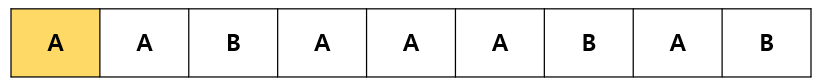
- 인덱스가 0일 경우에는 **접두사**와 **접미사**가 없다고 판단한다.
- 그래서 이 경우에는 LPS가 0이다.

<br>

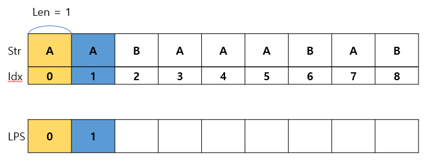
- 이제 AA를 보자, 이전에 len은 0이었기 때문에, 이번에는 1만큼 길이의 접두사, 접미사를 검사한다.
- 접두사는 `A`, 접미사도 `A`로 서로 동일하다.
- 이 경우에 len의 값은 동일한 부분 `A`의 길이인 1이 된다.
- Len의 값은 LPS값이다.

<br>

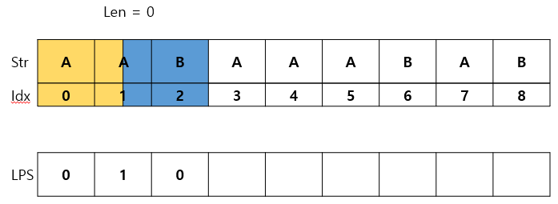
- 이제 인덱스를 2까지 늘리면 위 이미지와 같다.
- 접두사는 `AA`, 접미사는 `AB`로 서로 다르다.
- 이 경우에 실패 배열 알고리즘은 일정한 규칙에 따라 앞부분으로 이동해서 다시 공통 부분을 찾는다.
- 하지만 이 경우에는 1짜리 공통 부분을 찾고 싶어도 접두사는 `A`, 접미사는 `B`로 서로 달라서 LPS값은 0이 된다.

<br>

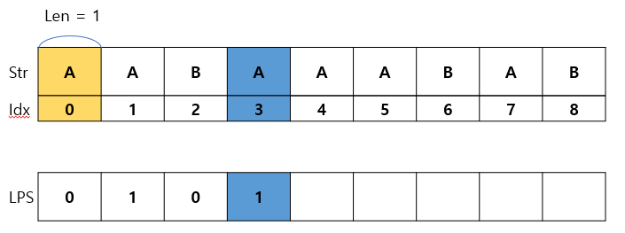
- 이전에 len이 0이었기 때문에, 이제 다시 길이 1만큼 문자열을 검사한다.
- 1만큼 확인해보니, 접두사 `A`, 접미사는 `A`로 서로 동일한 것을 확인 할 수 있다. 그럼 len을 1로 올린다.
- 그래서 len = 1, LPS[3]의 값은 1이 된다.

<br>

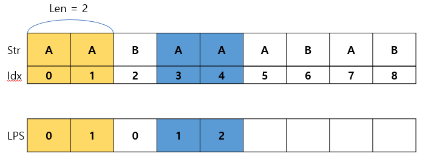
- 이전에 len=1 성공했기 떄문에, 길이 2만큼 확인해야 한다.
- 접두사는 `AA`, 접미사는 `AA`로 동일하므로 성공이다. 성공이면, len을 2로 올린다.
- 그래서 len = 2, LPS[4]의 값은 2가 된다.

<br>

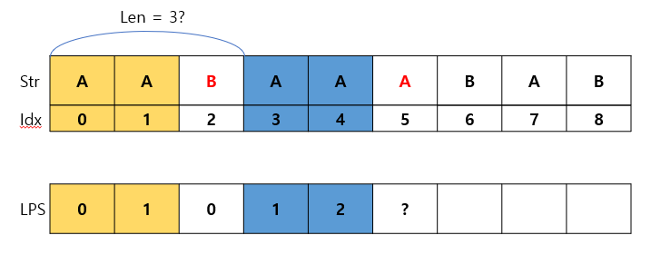
- 이전에 2짜리 길이가 성공했으므로, 이제 길이 3만큼 확인해보자
- 그런데 B != A로 서로 다른 부분을 찾았다
- 이 경우에 우리는 **일정 수치만큼 len을 줄여서** 다시 접두사와 접미사를 확인해야 한다.
- 여기서 일정 수치만큼의 뜻은 len을 **LPS[len - 1]** 로 줄여서 다시 확인해야 한다.
- 그리고 len을 LPS[len - 1]로 만드는 부분을 이해하는데, 필자는 3일에 가까운 시간을 쏟았다.
- 그래서 우선 넘어가고 밑에서 좀 더 자세하게 설명하겠다.

<br>

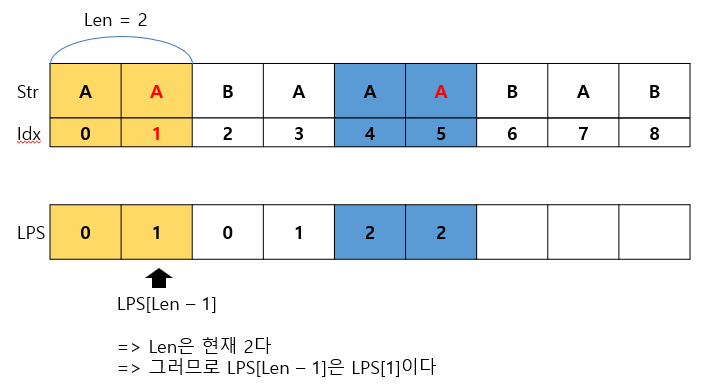
- 위에서 틀렸을 경우, 우리는 Len값이 LPS[len - 1] 값이 된다고 설명하였다.
- 기존에 Len은 2였고, 3을 도전했다가 실패했으므로 여전히 Len값은 2다.
- 그래서 실패한 시점에 LPS[len - 1]은 LPS[1]이고, 이는 1이다. 즉 우리는 틀린 현 시점에 Len이 1이라는 뜻이다.
- 그리고 **매우 매우 중요한 점은** 우리는 **Str[len]과 Str[Idx] 값을 비교** 한다는 점이다.
- 기존에 우리가 LPS를 찾는 과정을 다시 생각해보자
- **Len이 1이었으면, 2만큼 검사하고**, **Len이 2였으면, 3만큼 검사한다!**
- 우리는 **Len이 틀린 시점 1**이므로 **2만큼 검사한다!**

<br>

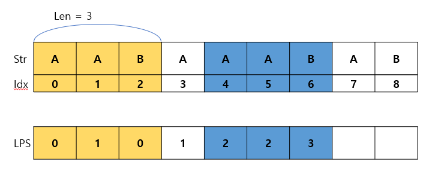
- 위에서 계속 한 것의 연장이다. 이전에 len이 2였으므로 3만큼 검사한다.
- 접두사와 접미사가 `AAB`로 동일하니, len을 3으로 갱신하고 lps[6]은 3이 된다.

<br>

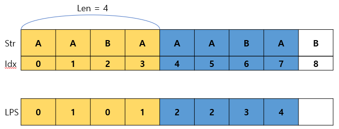
- 이전에 len이 3이였므르로 4만큼 검사한다.
- 접두사와 접미사가 `AABA`로 동일하니, len을 4로 갱신하고 lps[7]은 4가 된다.

<br>

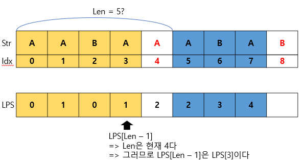
- 이전에 len이 4였으므로 5만큼 검사하려고 했는데, 접두사는 `AABAA`, 접미사는 `AABAB`로 마지막 글자가 다르다.
- 이 경우에 다시 **일정한 규칙** 대로 len값을 줄여서 다시 검사해야 한다.
- 줄이는 방법은 LPS[Len - 1]값으로 Len을 줄이는 것이다.
- 여기서는 Len이 4였으므로, LPS[Len - 1]은 LPS[3]을 의미하고 이 값은 1이다.
- 즉! Len은 1이 되고 우리는 **길이 2만큼(우리는 항상 Len보다 1더 길게 검사해왔다)** 다시 검사해야 한다.

<br>

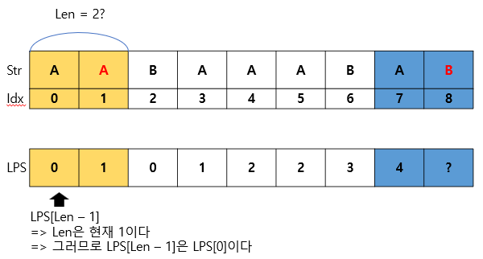
- 2만큼 검사했는데, 이번에도 틀렸다. 접두사는 `AA`, 접미사는 `AB`로 서로 다르다.
- 그럼 다시 LPS[Len - 1]을 보면 기존에 Len은 1이였으므로, LPS[0], 0이 Len이 된다.

<br>

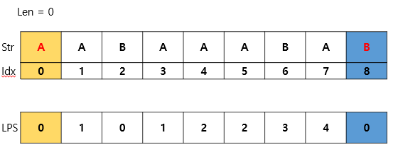
- 마지막으로 Len이 0이었으므로, 길이 1만큼 검사한다.
- 접두사와 접미사가 `A`, `B`로 각각 다르기 때문에, Len은 0으로 끝나고 LPS[8]은 0으로 LPS, 실패배열 구하는 로직이 끝이 난다.

<br>

---

<br>

### **4. LPS 보충 설명 !!!!중요!!!!**

> LPS를 만들면서 가장 헷갈렸던 점이 몇 가지 있다.<br>
> Len의 의미<br>
> LPS[len - 1]의 의미<br>

#### **Len의 의미**

- Len은 검사하는 문자열의 [0 ~ 어느 Index] 까지 **접두사와 접미사가 일치하는 길이**다.
- 만약 이전 글자에서 2글자까지 같았다면?? 다음 글자까지 접두사와 접미사가 같은지 검사하는 것이다.
- 그래서 Len이 이전에 3이였다면 다음에는 4만큼 검사하고, 4였다면 5만큼 검사하는 것이다.
- 그럼 만약에 다음 글자를 검사했는데 일치하지 않는다면?? => 이 때 LPS[len - 1]을 사용 하는 것이다.
- 그리고 우리가 검사하려는 문자열의 Index는 LPS처리가 끝나면 하나씩 증가시킨다.

#### **LPS[len - 1]의 의미**

- 내가 이 글을 쓰게 하는 가장 큰 계기 이며, 3일간 고통 받게 한 원인
- LPS[len]을 이해하기 위해 먼저 LPS[Idx]이 뭔지 생각해보자

> **LPS[Idx]는 문자열 0부터 Idx까지 `"최대로 일치한 접두사, 접미사의 길이다"`**

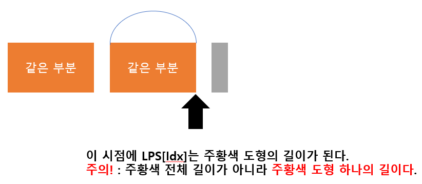
- 이해하기 쉽게 문자열을 색으로 표현해 보겠다.
- 여기서 Idx는 검은색 화살표의 위치다.
- 이 시점에서 LPS[Idx]는 주황색 도형 하나의 길이가 된다.

<br>

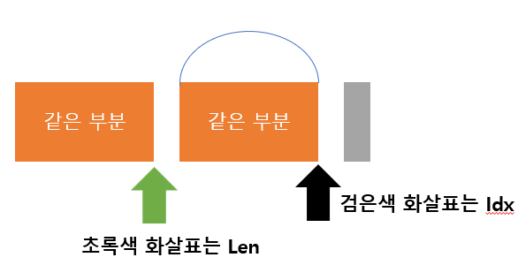
- 그런데 우리가 여기서 알고 싶은 건 LPS[len - 1]의 의미였다.
- 그럼 Len은 이 시점에 어디서 뭘 하고 있는지 보자면 위 이미지에 초록색 화살표로 있다.
- 이전에 접두사와 접미사가 일치했다면 Len이 가리키는 초록색 화살표가 오른쪽으로 한칸 이동해서 다음 글자를 비교한다.
- 그리고 그 다음 글자가 같다면 접두사와 접미사가 여전히 일치한다는 뜻이므로 계속 LPS값이 갱신되는 것이다.
- 우리는 다음 검사하는 글자가 **틀렸을 때**가 중요하므로 한번 틀려보자

<br>

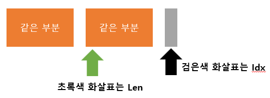
- 틀린 상황은 위와 같다.
- 그럼 이 상황에서 Len - 1이 의미하는 것이 보일 것이다. (그랬으면 좋겠다)
- Len - 1은 **바로 이전에 일치했던 접두,접미사의 최대길이** 라는 점이다. (여기서는 주황색 도형 하나의 가로 길이)
- 그럼 LPS[len - 1]의 의미는 결국
> **이전에 일치했던 접두,접미사의 최대 길이의 LPS값**이다.
- 이 문장을 여러번 되뇌여도 이해가 어려웠기 때문에 이미지를 하나 더 보겠다.

<br>

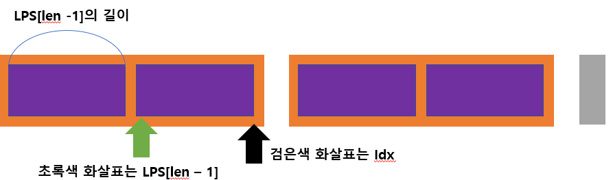
- 우리의 기존 문자열을 시각적으로 확대 해보았다.
- 주황색 문자열이 만약에 동일한 문자열 2개로 이루어진 문자열이였음을 가정한다.
  - ex) 주황색 : ABAB, 보라색 : AB
- 우리는 이미 알고 있는 내용으로 LPS[Len - 1]을 통해 **"주황색 길이 만큼"** 회색 글자 이전에 접두사와 접미사가 동일한 것을 보장 받았다.
- 그럼 회색 글자에서 틀렸을 때 일치하는 접두사와 접미사의 길이가 바로 0일까? 아니다.
  - ex AB[A] 처럼 끝에 한글자씩 같을 수도 있다.
- 그럼 틀렸을 때, 다시 처음 부터 한글자씩 확인해야 하는가?
- **아니다!!**
> **바로 이 부분 때문에 LPS[len - 1]을 사용하는 것이다.**

- 그럼 LPS[Len -1]의 `값`은 무엇을 의미하는가?
- 바로 **틀리기 이전까지**의 최대 접두,접미사의 길이까지의 **부분 문자열**에서 **최대 접두,접미사의 길이** 를 **다시 구하는 것**이다!!!
- 위 이미지에서는 틀리기 직전 최대 접두 접미사의 길이는 오렌지색 도형의 가로길이 == Len - 1 값
  - 좀 더 보충 설명을 하면 우리는 이전에 len만큼 성공했으면, 그 다음에 **우선 len값을 하나 늘려서** 검사한 후
  - 맞으면 이미 1 늘린 len 값을 LPS값에 갱신하기 때문에 실패했을 때, 이미 늘린 len값을 뺴주는 len - 1 값이 이전에 최대 길이 값이 되는 것이다.
- 그 오렌지색 도형의 안에서의 최대 **접두,접미사의 길이를 다시 구한것**이 바로 보라색 도형의 가로 길이다 == LPS[Len - 1]의 값
- 그런데 왜 초록색 화살표는 한칸 오른쪽에 있는가?
- 그 이유는 화살표가 가리키는 곳은 전부 Index 값이기 때문이다. 우리가 인덱스를 셀 때는 0부터 세기 때문에, 한칸 더 오른쪽으로 이동한다.
  - ex) ABBABBC 라는 문자열이 있고, 접두사 ABBA, 접미사 ABBC로 마지막 인덱스에서 틀렸다고 할 때, len - 1의 값은 3이고 LPS[len - 1] 값또한 3인데, ABBABBC에서 3이 가리키는 글자는 ABB[**A**]BBC로 4번 째 A를 가리킨다.

<br>

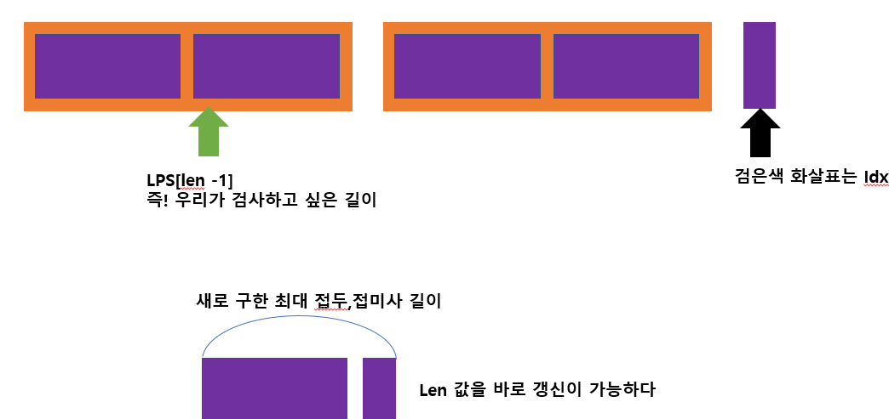
- 그럼 이 방법을 왜 사용할까?
- 만약에 회색 글자가 마침 보라색 블록의 첫번째 글자와 같다고 가정해보자
- 공통 주황색 안에서 보라색 만큼 또 접두사와 접미사가 같다는 보장이 된다면, 우리는 공통 접두사, 접미사를 처음부터 계산하는 것이 아니라 같다고 보장 받는 부분부터 다시 이어서 계산 할 수 있다.
- 즉 틀렸을 때, 뒤로 돌아가서 딱 한번만 더 확인하고 공통 접두, 접미사의 길이를 구할 수 있는 것이다.

<br>

---

#### **4-1. make_lps 예시 코드**

```c++
void make_lps(vector<int> &v, string &p)
{
	int size = p.length();
	int len = 0;
	int i = 1;

	while (i < size) {
		if (p[i] == p[len]) {
			len++;
			v[i++] = len;
		}
		else {
			if (len != 0)
				len = v[len - 1];
			else
				v[i++] = 0;
		}
	}
}
```

<br>

---

### **5. KMP 함수**

- KMP함수도 LSP를 구하는 함수와 매우 유사하다.

<br>

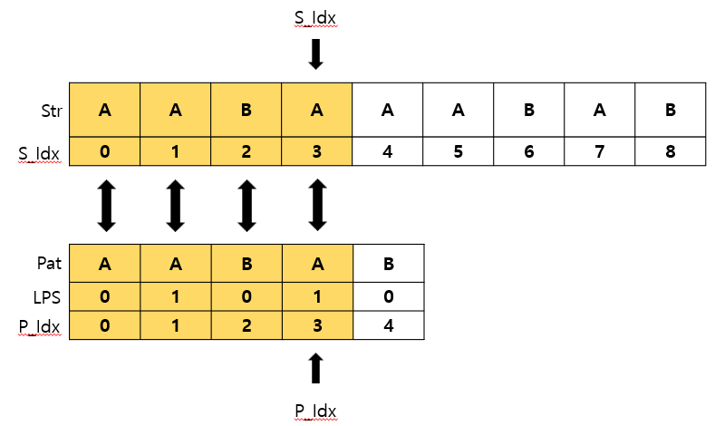
- 우리가 탐색하려는 문자열 STR과 찾으려는 패턴 PATTERN 각각 인덱스를 따로 관리한다.
- 만약 Str과 Pat의 인덱스에 해당하는 글자가 같다면 인덱스가 각각 증가한다.
- 이미지 상에서 AABA까지 비교했는데, 같았기 때문에 계속 증가한 모습이다.
- P_Idx가 Pat의 길이와 동일해지는 순간이 부분 문자열을 찾은 순간이 된다. (return true)

<br>

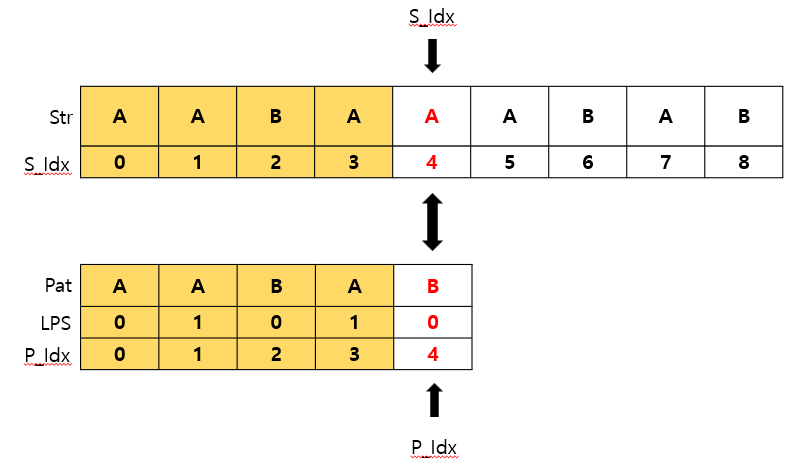
- 문제는 틀렸을 경우다.
- 위 이미지 처럼 틀렸을 경우 S_Idx를 옮기든, P_Idx를 옮기든 해야한다는 것이다.

<br>

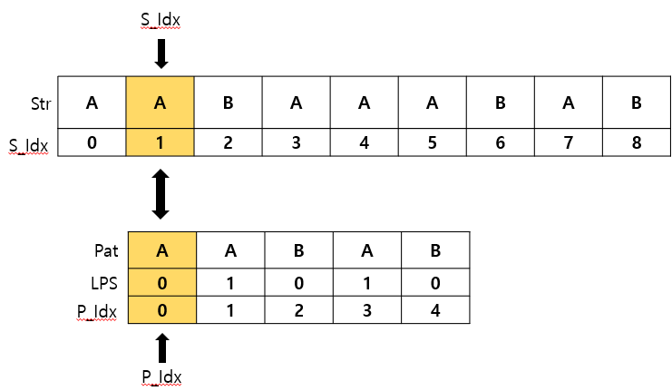
- 위 이미지는 전통적인 완전 탐색 방법이다. (KMP X)
- 틀렸을 경우 다시 앞으로 돌려서 한글자씩 다시 비교한다.
- 위 경우 시간 복잡도는 (Str의 길이) * (Pat의 길이) 가 된다.
- 이럼 Str이나 Pat가 커질 때마다 시간복잡도가 곱연산으로 커지기 때문에 비효율적이다.

<br>

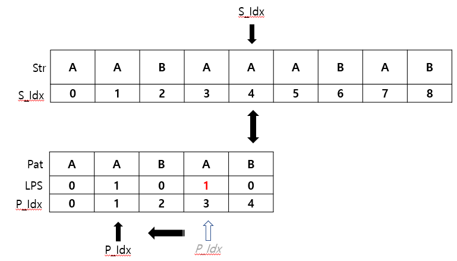
- 위 이미지는 KMP 알고리즘을 적용한 이미지다.
- KMP알고리즘에서 **STR의 인덱스는 절대 뒤로 가지 않는다.**
- 위 예시에서는 Lps[p_index - 1]로 P_index를 뒤로 돌린다.
- P_index는 기존에 4였기 때문에 LPS[4 - 1]로 P_index는 1이 되는 것이다.

<br>

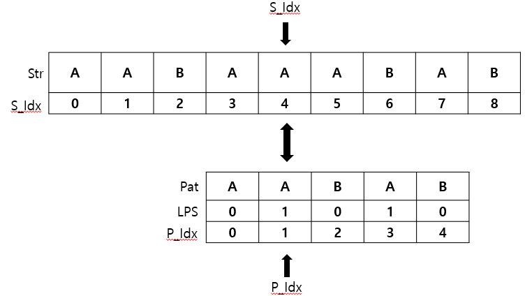
- P_Idx를 뒤로 옮긴다는 것은 패턴 문자열을 앞으로 당긴다는 의미이다.
- 이러면 시간복잡도를 곱에서 합인 (Str의 길이) + (Pat의 길이)로 확 줄일 수 있다.

<br>

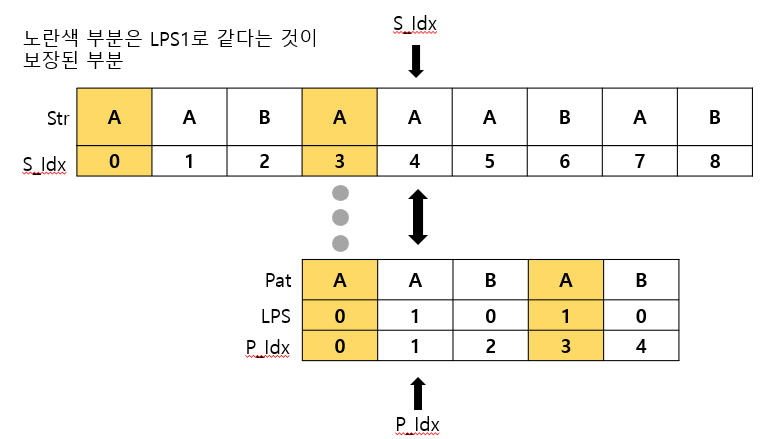
- LPS함수 만들때와 매우 유사하다.
- 왜 p_index = lps[p_index - 1];로 이어서 할 수 있을까
- 그건 P_index - 1은 이전까지 동일했던 부분 문자열의 길이다. (위 경우 AABA로 4)
- 그리고 LPS[P_index - 1]은 그 부분 문자열"의" 공통 접두,접미사의 길이다.
- 위 이미지에서 노란 부분이 그 부분이다.
- 그렇다는 건 우리는 이미 `"알려진"` 공통 부분은 `"굳이 확인하지 않고 넘어가도"` 괜찮다는 뜻이다.
- 그래서 Pattern 문자열의 LPS[P_index - 1] 부터 다시 검사하는 것이 가능하게 성립한다.
- 참고로 Pat문자열과 Str의 문자열이 처음부터 틀리면 그냥 S_index 하나 늘려서 검사하면 된다.

<br>

#### **4-1. KMP 예시 코드**

```cpp
bool KMP(vector<int> &lps, string &s, string &p)
{
	int s_index = 0;
	int p_index = 0;

	int s_len = s.length();
	int p_len = p.length();

	while (s_index < s_len) {

    // 우리가 검사한 글자가 같을 경우
		if (s[s_index] == p[j]) {
			s_index++;
			p_index++;
			if (p_index == p_len)
				return true;
		}

    // 우리가 검사한 글자가 틀린 경우
		else {

      // 패턴의 첫 글자부터 틀린경우
			if (p_index == 0)
				s_index++;
      // 패턴이 맞던 부분이 있었던 경우
			else
				p_index = lps[p_index - 1];
		}
	}
	return false;
}
```

<br>

---

### **6. 백준 16916 소스코드**

```cpp
#include <iostream>
#include <string>
#include <vector>
#define fast ios::sync_with_stdio(false), cin.tie(NULL), cout.tie(NULL);
using namespace std;

void make_lps(vector<int> &v, string &p)
{
	int size = p.length();
	int len = 0;
	int i = 1;

	while (i < size) {
		if (p[i] == p[len]) {
			len++;
			v[i++] = len;
		}
		else {
			if (len != 0)
				len = v[len - 1];
			else
				v[i++] = 0;
		}
	}
}

bool KMP(vector<int> &lps, string &s, string &p)
{
	int s_index = 0;
	int p_index = 0;

	int s_len = s.length();
	int p_len = p.length();

	while (s_index < s_len) {
		if (s[s_index] == p[p_index]) {
			s_index++;
			p_index++;
			if (p_index == p_len)
				return true;
		}
		else {
			if (p_index == 0)
				s_index++;
			else
				p_index = lps[p_index - 1];
		}
	}
	return false;
}

int main(void) {
	fast;

	string s, p;
	cin >> s >> p;

	if (s.length() < p.length())
		cout << 0;
	else {
		vector<int> lps(p.length(), 0);
		make_lps(lps, p);
		if (KMP(lps, s, p))
			cout << 1; // 부분 문자열이면 1 출력
		else
			cout << 0; // 부분 문자열이 아니면 0 출력
	}
}


```
