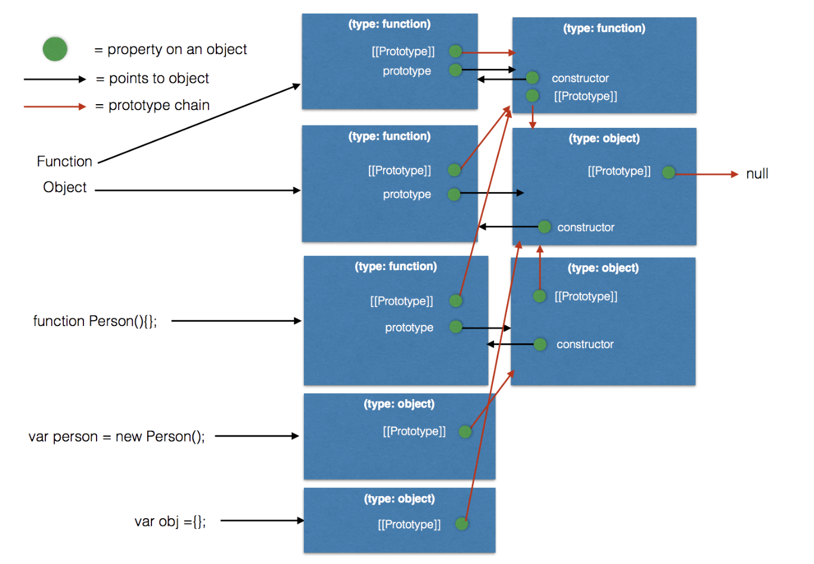

[⬅️ 상위 README로 이동](../README.md)
## 📦 JavaScript에서 Prototype과 __proto__ 체계

## 📌 목차

- [1. 개요](#1-개요)
- [2. prototype과 __proto__의 역할](#2-prototype과-__proto__의-역할)
- [3. new 키워드와 객체 생성 과정](#3-new-키워드와-객체-생성-과정)
- [4. 함수(Function)와 객체(Object)의 생성 구조](#4-함수function와-객체object의-생성-구조)
- [5. 프로토타입 체인과 프로퍼티 탐색 과정](#5-프로토타입-체인과-프로퍼티-탐색-과정)
- [6. Function.prototype은 왜 함수인가](#6-functionprototype은-왜-함수인가)
- [7. 코드 기반 정리 및 요약](#-7-실험-코드-기반-핵심-정리-stack-overflow-이미지-구조-기반)
- [📌 참고 자료](#-참고-자료)

---

### **1. 개요**

- 자바스크립트는 **프로토타입 기반(prototype-based)** 언어이다.
- 객체는 **__proto__** 링크를 통해 상속 체인을 형성한다.
- 함수(Function)와 객체(Object)는 prototype, __proto__ 체계를 통해 긴밀히 연결된다.
- 함수는 [[Call]]과 [[Construct]] 내부 슬롯을 가지는 특별한 객체이다.

---

### **2. prototype과 __proto__의 역할**

#### **2.1 prototype**

- **함수(Function)**가 가진 **"설계도 객체"**. (일반 객체는 존재하지 않는다. typeof로 확인하면 undefine)
- `new` 키워드로 인스턴스 생성 시, 새 객체의 `__proto__`가 생성자의 `prototype`으로 설정된다.
- 즉 **prototype은 내 자식에게 물려줄 요소들의 집합** 이라고 비유할 수 있다.

```javascript
function Person() {}
console.log(Person.prototype); // { constructor: Person }
```

#### **2.2 __proto__**

- **모든 객체**가 가진 숨겨진 링크.
- 프로퍼티 탐색 시 상속 체인을 따라가는 경로.
- 즉 **__proto__는 내 부모로 부터 물려 받은 것들이 모여 있는 곳** 이라고 비유할 수 있다.

```javascript
let p = new Person();
console.log(p.__proto__ === Person.prototype); // true
```

---

### **3. new 키워드와 객체 생성 과정**

1. 빈 객체 `{}`를 생성
2. 객체의 `__proto__`를 생성자 함수의 `prototype`으로 설정
3. 생성자 함수 호출 (this 바인딩)
4. 명시적 반환값이 없으면 새 객체 반환

```javascript
function Animal(name) {
  this.name = name;
}
let dog = new Animal("Buddy");
console.log(dog.__proto__ === Animal.prototype); // true
```

---

### **4. 함수(Function)와 객체(Object)의 생성 구조**

| 객체 | __proto__ | prototype |
|:---|:---|:---|
| Function (내장 생성자 함수) | Function.prototype | Function.prototype |
| Object (내장 생성자 함수) | Function.prototype | Object.prototype |
| 사용자 함수(Person) | Function.prototype | Person.prototype |
| Person.prototype (객체) | Object.prototype | (X) |

---

### **5. 프로토타입 체인과 프로퍼티 탐색 과정**

1. 자기 자신에서 프로퍼티 탐색
2. 없으면 `__proto__`를 따라 부모 탐색
3. Object.prototype까지 찾아도 없으면 undefined 반환

```javascript
function Person() {
  this.name = "Alice";
}
Person.prototype.sayHi = function() {
  console.log("Hi");
};

const p = new Person();
p.sayHi(); // p에는 sayHi 없음 → p.__proto__ (Person.prototype)에서 찾음
```

---

### **6. Function.prototype은 왜 함수인가**

- ES5 명세에서 Function.prototype은 스스로 **Function 객체**가 되어야 한다고 규정한다.
- 이유:
  - 함수들의 프로토타입인 Function.prototype이 **호출 가능(callable)** 해야 한다.
  - 과거(ES5 이전) 코드들과 **호환성 유지**를 위해.

✅ 표준 문서 규정:
> The Function prototype object is itself a Function object (its [[Class]] is "Function") that, when invoked, accepts any arguments and returns undefined.

✅ 요약:
- `Function.prototype`은 진짜 함수로 만들어져 있다.
- 그래서 `typeof Function.prototype === "function"`
- 호출해도 된다: `Function.prototype()` → undefined 반환
- 이 덕분에 Function을 상속하는 모든 함수가 호출 가능성을 문제없이 물려받는다.

✅ 추가로 ES6에서는 다른 빌트인 프로토타입들은 "일반 객체"로 변경되었지만,
Function.prototype은 **호환성을 위해 여전히 함수 객체로 유지**되었다.

| 프로토타입 | ES5 | ES6 |
|:---|:---|:---|
| Function.prototype | 함수 객체(호출 가능) | 함수 객체(호출 가능, 유지) |
| Object.prototype | 객체 | 객체 |
| Array.prototype | 배열 객체 | 배열 객체(유지) |
| Boolean.prototype | Boolean 객체 | 일반 객체로 변경 |
| Number.prototype | Number 객체 | 일반 객체로 변경 |

---

### 📦 7. 실험 코드 기반 핵심 정리 (stack overflow 이미지 구조 기반)



#### 7-1 등장하는 주요 객체

- `Function` (내장 함수 생성자)
- `Object` (내장 객체 생성자)
- `Person` (사용자 정의 생성자 함수)
- `person` (`new Person()` 인스턴스)
- `obj` (`{}` 리터럴 객체)

---

#### 7-2 Function

```javascript
console.log(typeof Function.__proto__); // "function"
console.log(typeof Function.prototype); // "function"
console.log(Function.__proto__ === Function.prototype); // true
console.log(Function === Function.prototype); // false
```

| 항목 | 값 | 설명 |
|:---|:---|:---|
| typeof Function.__proto__ | "function" | Function은 Function.prototype을 부모(__proto__)로 가진다 |
| typeof Function.prototype | "function" | Function.prototype 자체도 호출 가능한 함수 객체다 |
| Function.__proto__ === Function.prototype | true | Function 객체의 __proto__는 Function.prototype이다 |
| Function === Function.prototype | false | Function 객체와 Function.prototype 객체는 다르다 |

✅ **Function은 Function.prototype을 상속하는 함수 객체다.**

---

#### 7-3 Object

```javascript
console.log(typeof Object.__proto__); // "function"
console.log(typeof Object.prototype); // "object"
```

| 항목 | 값 | 설명 |
|:---|:---|:---|
| typeof Object.__proto__ | "function" | Object는 Function.prototype을 부모로 가진 함수 객체다 |
| typeof Object.prototype | "object" | Object.prototype은 일반 객체이다 |

✅ **Object는 함수(Function)로서 동작하지만, 그 프로토타입(Object.prototype)은 일반 객체이다.**

---

#### 7-4 Person (사용자 정의 생성자)

```javascript
function Person() {}
console.log(typeof Person.__proto__); // "function"
console.log(typeof Person.prototype); // "object"
```

| 항목 | 값 | 설명 |
|:---|:---|:---|
| typeof Person.__proto__ | "function" | Person 함수는 Function.prototype을 부모로 가진다 |
| typeof Person.prototype | "object" | Person.prototype은 일반 객체다 |

✅ **Person은 Function.prototype을 부모로 가지는 사용자 정의 함수다.**

---

#### 7-5 person (new Person()) 객체

```javascript
let person = new Person();
console.log(typeof person.__proto__); // "object"
console.log(typeof person.prototype); // "undefined"
```

| 항목 | 값 | 설명 |
|:---|:---|:---|
| typeof person.__proto__ | "object" | person 인스턴스는 Person.prototype을 부모로 가진다 |
| typeof person.prototype | "undefined" | 인스턴스는 prototype 프로퍼티를 갖지 않는다 |

✅ **new Person()으로 생성된 인스턴스는 Person.prototype을 __proto__로 가진다.**

---

#### 7-6 obj (`{}` 리터럴 객체)

```javascript
let obj = {};
console.log(typeof obj.__proto__); // "object"
console.log(typeof obj.prototype); // "undefined"
```

| 항목 | 값 | 설명 |
|:---|:---|:---|
| typeof obj.__proto__ | "object" | obj는 Object.prototype을 부모로 가진다 |
| typeof obj.prototype | "undefined" | 일반 객체는 prototype 프로퍼티를 가지지 않는다 |

✅ **리터럴 `{}` 로 생성된 객체는 Object.prototype을 부모로 가진다.**

---

#### 7-7 전체 구조 요약

```plaintext
Function
  ├─ __proto__ → Function.prototype
  └─ prototype → (type: function) [호출 가능한 빈 함수]

Object
  ├─ __proto__ → Function.prototype
  └─ prototype → (type: object) [일반 객체]

Person (사용자 정의 생성자)
  ├─ __proto__ → Function.prototype
  └─ prototype → (type: object) [Person.prototype 객체]

person (new Person() 인스턴스)
  └─ __proto__ → Person.prototype
      └─ __proto__ → Object.prototype
          └─ __proto__ → null

obj (리터럴 객체)
  └─ __proto__ → Object.prototype
      └─ __proto__ → null
```

---

#### 7-8 그럼 prototype의 __proto__는???

- prototype을 설명하는 대부분의 글에서 잘 없는 내용이기도 하고, 필자가 공부하다가 제일 헷갈렸던 부분이라 남겨둔다.
- **__proto__는 모든 객체가 가지고 있음**을 다시 기억하자.
- 즉 어떤 함수 f가 있다고 한다면 **f의 __proto__와 f의 prototype의 __proto__는 각각 존재한다!!!**
- Function 내장 생성자 함수로 예를 들면 **Function의 __proto__는 function이고**, **Function의 prototype의 __proto__는 object로 서로 다르다!!!**

---

#### 7-9 핵심 요약 문장

- **"Function, Object, Person은 모두 Function.prototype을 부모로 가지는 함수 객체다.**
- **생성된 인스턴스(person, obj)는 각각 Person.prototype, Object.prototype을 __proto__로 삼는다.**
- **Function과 Function.prototype은 같은 객체가 아니라, Function의 부모가 Function.prototype이다."**


### 📌 참고 자료

- [MDN - Prototype chain](https://developer.mozilla.org/en-US/docs/Web/JavaScript/Inheritance_and_the_prototype_chain)
- [V8 blog - Fast Properties and Hidden Classes](https://v8.dev/blog/fast-properties)
- [StackOverflow - Why is Function.prototype a function?](https://stackoverflow.com/questions/32928810/function-prototype-is-a-function)
---

> ✨ **최종 요약**
>
> **prototype은 new를 위한 설계도, __proto__는 런타임 상속 경로, [[Call]]은 함수 호출성을 제공하며, Function.prototype이 function 타입인 이유는 호출성과 과거 코드 호환성을 유지하기 위해서다.**
